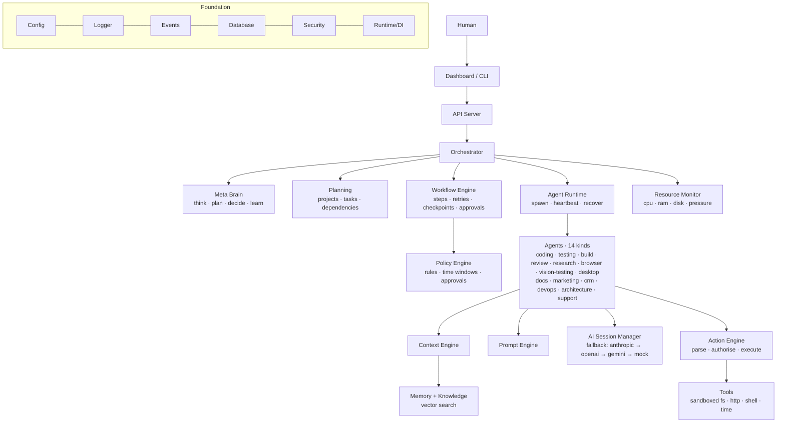

# MegaAI

**An autonomous AI company operating system.** You write one sentence —
*"Build this client a complete ecommerce store"* — and MegaAI plans the
project, divides it into tasks, assigns them to specialised agents, executes
them through policy-checked tools, recovers from provider limits and
failures, reports progress live, and learns from every outcome.

```
megaai demo
```

```
  ✔ Requirements research            ✔ Cart and checkout flow
  ✔ System architecture              ✔ Automated test suite
  ✔ Project scaffold setup           ✔ Code review pass
  ✔ Database schema and models       ✔ Project documentation
  ✔ Authentication module            ✔ Launch marketing content
  ✔ Product catalog API              ✔ Deployment preparation
  ✔ Storefront UI pages              ✔ Client CRM update

Result: completed · Tasks: 14/14 · 15 files written to workspace/
```

The demo runs **fully offline** on a deterministic mock provider — no API
keys needed. Add `ANTHROPIC_API_KEY` (or OpenAI/Gemini keys) and the same
pipeline runs on real models with automatic cross-provider fallback.

---

## The loop MegaAI runs

| Pillar | What happens | Where |
| --- | --- | --- |
| **Think** | Goal analysis: domain, features, risks | `@megaai/meta-brain` |
| **Plan** | Phased plan with typed tasks | `@megaai/meta-brain` → `@megaai/planning` |
| **Divide** | Milestones + dependency-graphed tasks | `@megaai/planning` |
| **Assign** | Right agent kind + model tier per task | `@megaai/orchestrator` + `@megaai/agents` |
| **Monitor** | Events, metrics, heartbeats, audit, dashboard | `@megaai/events` / `@megaai/runtime` / `apps/server` |
| **Recover** | Provider fallback chains, task retries, agent restarts, workflow checkpoints | `@megaai/ai` / `@megaai/workflow` / `@megaai/agents` |
| **Learn** | Per-agent/per-provider outcome stats, repeated-failure lessons | `@megaai/meta-brain` |

## Architecture



Every arrow is a typed contract (`@megaai/contracts`); every box is its own
package. Full detail in [ARCHITECTURE.md](./ARCHITECTURE.md), original
vision in [docs/VISION.md](./docs/VISION.md), phase plan in
[ROADMAP.md](./ROADMAP.md).

## Run it in the cloud (no local machine needed)

MegaAI ships a hosted platform: a **Next.js dashboard on Vercel** (login-only
auth, API keys entered in the UI and AES-256 encrypted in MongoDB, users
managed by the admin) with **GitHub Actions as the execution engine** — every
goal runs the full MegaAI engine on a runner and reports back live. Recurring
goals run on an Actions cron. Setup in ~15 minutes: **[SETUP-CLOUD.md](./SETUP-CLOUD.md)**.

## Quick start (local)

Requires Node.js ≥ 20.

```bash
npm install
npm run build

# offline end-to-end demo (mock provider, auto-approve)
node apps/cli/dist/index.js demo

# see the plan for any goal without executing it
node apps/cli/dist/index.js plan "Build an ERP with inventory and accounting"

# execute a goal (state persists in .megaai/, output in workspace/)
node apps/cli/dist/index.js run "Build a small api for invoices"

# projects, learning stats, provider status
node apps/cli/dist/index.js status

# train the models pack (UI-purpose, lead-scoring, error-triage) into .megaai/models
node apps/cli/dist/index.js train

# live dashboard + REST API on http://127.0.0.1:4100
node apps/server/dist/index.js
```

With the server running you get a real-time dashboard (projects, agents,
providers, resource pressure, live event feed, pending approvals with
approve/reject buttons) and a REST API:

| Endpoint | Purpose |
| --- | --- |
| `POST /api/goals` `{ "goal": "…" }` | Start a goal (runs async) |
| `POST /api/approvals/:id` `{ "approved": true }` | Resolve a human approval gate |
| `GET /api/overview` | Everything the dashboard shows |
| `GET /api/projects` · `/api/projects/:id` | Projects and their tasks |
| `GET /api/stream` | Live events (SSE) |
| `GET /api/events` · `/api/logs` · `/api/health` | History, logs, service health |

By default a submitted goal **waits for human approval** of the plan before
executing (visible in the dashboard). Set `MEGAAI_AUTO_APPROVE=true` — or
`policy.autoApprove` in `megaai.config.json` — for full autonomy.

## Real AI providers

MegaAI runs on a **fallback chain** — the vision's "Claude limit? → try the
next provider" behaviour is built into the session manager:

```
anthropic → openai-compatible → gemini → openrouter → groq → mock
```

Bring your own keys **two ways**:

- **In the dashboard** (recommended) — open `http://127.0.0.1:4100/settings`,
  enter a key for any provider, set the fallback order, hit save. Keys are
  stored locally in `.megaai/settings.json` (gitignored) and the engine
  restarts on them immediately. The same page configures email delivery and a
  Vercel/Railway deploy token.
- **Environment variables** — `ANTHROPIC_API_KEY`, `OPENAI_API_KEY`,
  `GEMINI_API_KEY`, `OPENROUTER_API_KEY`, `GROQ_API_KEY`.

OpenRouter and Groq speak the OpenAI wire protocol, so they slot into the same
adapter. Unconfigured providers are skipped, so with only a Gemini/OpenRouter/
Groq key the chain lands on the first one that has a key and the rest cover
limits and outages. Rate limits are tracked per provider (requests/minute,
tokens/day); a 429 cools a provider down and the chain moves on mid-task,
without the agent noticing. Model tiers (`fast` / `balanced` / `frontier`) are
chosen per task complexity, and failed tasks escalate to a stronger tier on
retry. With no key at all, MegaAI runs fully offline on the mock provider.

Train the models pack harder on Colab and drop the result into
`.megaai/models/` — see [`notebooks/`](./notebooks/).

## What a goal produces

Every goal gets its own sandboxed directory under `workspace/` — and every
finished delivery is a **real git repository**, committed automatically by
the code engine:

```
workspace/build-a-small-api-for-invoices-52dd94/
├── .git/                 ← versioned delivery ("MegaAI delivery: …")
├── MEGAAI_REPORT.md      ← delivery report: tasks, states, AI usage, cost
├── package.json          ← written by the coding agent
├── src/…                 ← implementation files
├── tests/…               ← written AND executed (node --test) by the testing agent
├── docs/…                ← written by the documentation agent
├── marketing/…           ← written by the marketing agent
└── DEPLOYMENT.md         ← written by the devops agent
```

Agents can only touch files inside their workspace (path-escape attempts are
blocked), shell execution is off by default behind an allowlist, HTTP is
allowlist-only, `deploy`/`shell.exec` permissions are approval-gated, and
every action lands in the audit log.

## Trainable models

MegaAI trains its own small models **in-process, offline, on datasets it
generates itself** — no GPU, no downloaded corpus. `@megaai/models` ships
real classical ML (softmax logistic regression + multinomial naive Bayes)
and three concrete models:

| Model | Learns | Backs |
| --- | --- | --- |
| `ui-purpose` | what a UI element is *for* (submit, search, delete, nav, …) | vision element classification |
| `lead-scoring` | hot / warm / cold from lead signals | CRM / sales triage |
| `error-triage` | routes an error/log line to a category | recovery routing |

```bash
node apps/cli/dist/index.js train
#   ✔ ui-purpose      99% held-out accuracy (macro-F1 0.98)
#   ✔ lead-scoring    87% held-out accuracy (macro-F1 0.87)
#   ✔ error-triage    94% held-out accuracy (macro-F1 0.94)
```

Training is deterministic (seeded PRNG) and each model reports **held-out**
accuracy. Trained models persist to `.megaai/models/`; the SDK loads them on
boot (the UI-purpose model then replaces the vision heuristic) and exposes
them through the `model.predict` tool.

### Deep vision — seeing the screen

Three trained ONNX models go further, working from **pixels alone** with no DOM:

| Model | Task | Held-out |
| --- | --- | --- |
| `ui-detector` (YOLO11) | screenshot → every element with a box | **mAP50 0.936** |
| `screen-classifier` | screenshot → page kind (login/checkout/…) | **99.0%** |
| `ui-defect-detector` | screenshot → visual defect (overflow/overlap/…) | **88.4%** |

They train on a dataset MegaAI **generates itself** — synthetic pages rendered
in headless Chromium with boxes read from the DOM, so labels are exact and no
annotation is needed:

```bash
npm run dataset -- --count 3000        # 3000 pages, ~39k labelled boxes
```

Drop the weights into `.megaai/models/` and `desktop.observe({ pixels: true })`
finds elements from the screenshot. Details, per-class results and the dataset
bugs the training exposed: **[docs/TRAINED-MODELS.md](./docs/TRAINED-MODELS.md)**.

## Packages

| Layer | Packages |
| --- | --- |
| Foundation | `types` · `utils` · `contracts` · `config` · `logger` · `events` · `database` · `security` |
| Core runtime | `runtime` (DI, lifecycle, health, metrics, scheduler) · `resources` |
| AI layer | `ai` (providers, models, limits, sessions, fallback) |
| Execution | `memory` · `policy` · `planning` · `workflow` · `tools` · `actions` · `prompt` · `context` |
| Automation | `code` (git) · `browser` (Playwright) · `deploy` (approval-gated) · `comm` (channels + email + notifications) · `vision` (UI/responsive testing) · `desktop` (mouse/keyboard + element detection) · `crm` (clients/leads/invoices) · `jobs` (recurring) |
| Intelligence | `agents` (14 kinds) · `meta-brain` (template + model planning) · `orchestrator` · `models` (trainable ML pack) |
| Your machines | `mesh` (one durable queue across laptop, phone and cloud) · `node-agent` (the laptop agent: resource guard, crash-resume) · `coders` (drives Claude Code / Codex / OpenCode and hands work between them as quotas run out) |
| Surface | `sdk` · `apps/cli` · `apps/server` · `apps/node` · `apps/web` |

## Extending MegaAI

Everything pluggable goes through `@megaai/contracts` — the seams the
future plugin marketplace will use:

```ts
import { createMegaAI, ModelDrivenAgent } from '@megaai/sdk';

const megaai = createMegaAI({
  extraProviders: [myProvider],          // implements Provider
  extraTools: [myTool],                  // implements Tool
  extraAgents: [new ModelDrivenAgent({   // or a fully custom AgentImplementation
    kind: 'seo',
    name: 'SEO Agent',
    description: 'Optimises content for search',
    systemPrompt: 'You are an SEO specialist…',
    allowedTools: ['fs.write', 'fs.read'],
    defaultComplexity: 'standard',
  })],
});
await megaai.start();
await megaai.submitGoal('…');
```

See [CONTRIBUTING.md](./CONTRIBUTING.md) for the development workflow and
[docs/VISION.md](./docs/VISION.md) for where this is going: browser/desktop
automation, vision, deployment, communication channels, semantic memory,
distributed workers, and the plugin marketplace.

## Development

```bash
npm run build     # tsc -b across all 39 workspaces
npm test          # build + 312 tests (node:test, all offline)
npm run demo      # end-to-end smoke test
npm run clean     # remove build output
```

### A dependency advisory that cannot be fixed yet

`npm audit` reports two high findings for `adm-zip` reached through
`onnxruntime-node`, an *optional* dependency of `@megaai/models`. There is no
release of `onnxruntime-node` that uses a patched `adm-zip`, so `npm audit fix`
reports a fix and then changes nothing, and forcing it with an override means
regenerating the lockfile — which drops the platform binaries Windows and
Vercel need. It is left alone deliberately, and this is why that is
defensible: `adm-zip` is used only by `onnxruntime-node`'s install script, to
unpack an archive it fetched from Microsoft's own CDN over HTTPS. MegaAI never
calls it, and nothing reaches it at runtime. It will clear when
`onnxruntime-node` updates.

## Status

Phases 1–3 are complete: the foundation, the execution layer and the
automation layer (git-versioned deliveries, real build pipelines and test
execution, browser automation, approval-gated deployment, email and
notifications, the vision/UI testing engine on real headless Chromium, a
trainable models pack, desktop automation, a CRM engine and recurring jobs).

Work since then has been about making MegaAI run on **your** machines rather
than only in a cloud job. There is now one durable queue shared by the laptop,
the phone and the cloud, and an agent that lives on your laptop: it stays out
of your way while you are using the machine, drains the backlog when you walk
away, stops when the machine gets hot or the battery gets low, survives a
reboot as the same node, and drives Claude Code, Codex and OpenCode in turn —
handing the work on with full context each time one runs out of quota, and
parking it until the earliest reset when they all do. See
[docs/LAPTOP-AGENT.md](./docs/LAPTOP-AGENT.md) to set it up, and
[docs/DISTRIBUTED-PLAN.md](./docs/DISTRIBUTED-PLAN.md) for where it is going
(the phone node, live logs in the dashboard, voice and image input).

**39 workspaces (35 packages + 4 apps) · 312 tests · fully offline demo.**

## License

[MIT](./LICENSE)
